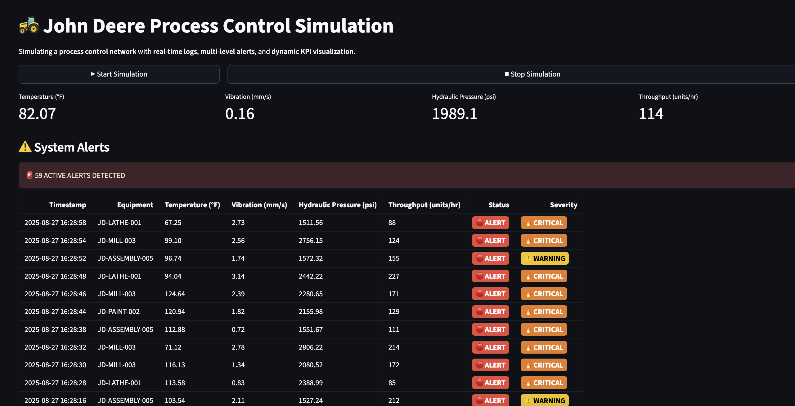

# 🚜 John Deere Process Control Simulation

A real-time simulation of a **process control network** with dynamic KPI monitoring, **multi-level alerts**, and live data streaming.

## 🌟 Features
- 📊 **Real-time KPI visualization** for temperature, vibration, hydraulic pressure, and throughput  
- 🚨 **Multi-level alerts**: OK, Warning, Critical, Emergency  
- 🟢 **Dynamic status & severity badges** for better readability  
- 📥 **Downloadable simulation logs** in CSV format  
- ⚡ Fully deployed on **Streamlit Cloud**

## 🛠️ Tech Stack
- **Python** → Core backend & data processing  
- **Streamlit** → Frontend visualization  
- **Pandas** → Data manipulation  
- **Mock Data Generator** → Simulated IoT sensor logs  

## 🚀 Live Demo
🔗 [Click here to try it out](https://jennys-process-control-sim.streamlit.app/)

## 📦 Installation

```bash
git clone https://github.com/<your-username>/john-deere-process-sim.git
cd john-deere-process-sim
pip install -r requirements.txt
streamlit run scripts/app.py
```

---

## 📸 Preview

|  |

---

## 📄 License / Disclaimer

This is a **public demo** using **simulated data only**—no proprietary Deere systems or data are exposed.
